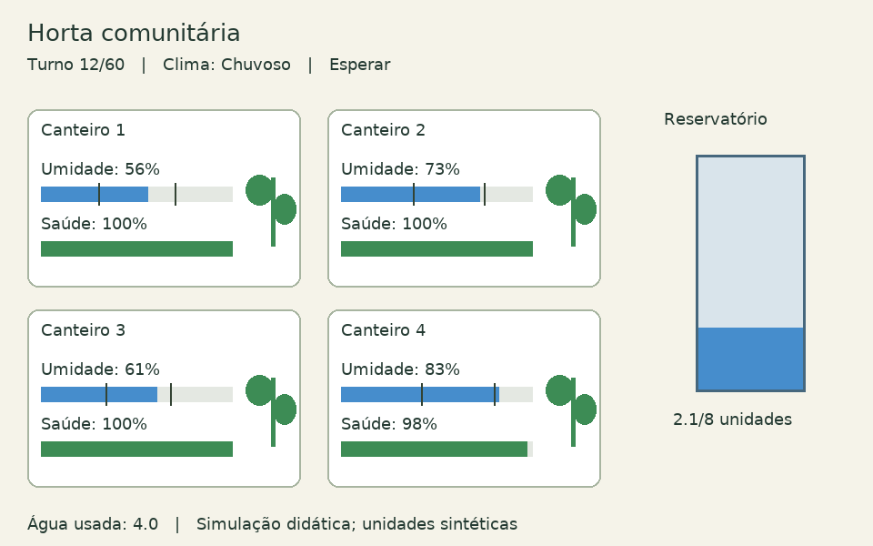

# Irrigação inteligente de uma horta comunitária

Trabalho de Aprendizado por Reforço: ambiente próprio no Gymnasium e comparação de DQN, PPO e A2C com Stable-Baselines3.

## Aprovação e integrantes

Integrantes: **Nicolas Cussioli Raimundo e Marcelo Fontana**. O desenvolvimento seguiu considerando tema, algoritmos e formação em dupla validados, conforme orientação dos integrantes em 26/09/2026. O nome do professor e o prazo de entrega precisam ser preenchidos.

<!-- RESULTS:START -->
## Resultados

54 treinamentos, 12 configurações de hiperparâmetros e cinco sementes finais por algoritmo. Cada modelo final foi avaliado em 100 episódios reservados. DP é o desvio entre treinamentos; referências fixas não possuem esse desvio.

| Método | Retorno médio ± DP | Sucesso | Água média |
|---|---:|---:|---:|
| A2C | 55.14 ± 0.61 | 92.8% | 16.86 |
| DQN | 54.42 ± 0.84 | 92.2% | 17.42 |
| PPO | 55.90 ± 0.26 | 94.2% | 16.20 |
| Aleatória | 13.58 | 0.0% | 22.38 |
| Heurística | 55.04 | 92.0% | 16.90 |

Notebook e relatório: `trabalho_horta.ipynb` e `reports/relatorio_horta.html`. Dados brutos e configuração de cada tentativa: `results/`.
<!-- RESULTS:END -->

## Ambiente

Quatro canteiros com necessidades diferentes disputam um reservatório de oito unidades. O agente observa umidade, saúde, água, clima e tempo restante; escolhe entre irrigar um dos quatro canteiros, reabastecer ou esperar. O clima segue uma cadeia de Markov. O episódio tem 60 turnos e pode terminar antes se todas as plantas morrerem. As regras são sintéticas e não representam manejo agronômico validado.



## Estrutura

- `horta/env.py`: MDP, Gymnasium, renderização e heurística de referência.
- `horta/experiments.py`: treinos, avaliação, seleção e registro retomável.
- `horta/analysis.py`: agregação, gráficos e execução ilustrativa.
- `configs/experimentos.json`: 12 configurações, orçamentos e sementes.
- `tests/test_environment.py`: verificações da API, água, terminalidade e sementes.
- `results/`: dados reais; o piloto de diagnóstico fica separado.
- `trabalho_horta.ipynb`: notebook integrado ao relatório.
- `scripts/build_report.py`: atualiza/executa o notebook e exporta HTML.
- `apresentacao/roteiro.md`: roteiro da apresentação.
- `requirements-lock.txt`: versões usadas (Python 3.12, Windows, PyTorch CPU).
- `artifacts/models/`: um modelo final por algoritmo, da semente 101, com registro de origem e checksum.

ZIPs das aulas, ambiente virtual, demais modelos e vídeos brutos ficam fora dos novos commits. Os ZIPs enviados inicialmente ainda constam no histórico antigo.

## Instalação

Na raiz do projeto, com Python 3.12:

```powershell
python -m venv .venv
.venv/Scripts/python.exe -m pip install -r requirements-lock.txt --extra-index-url https://download.pytorch.org/whl/cpu
```

O lock registra o ambiente utilizado. Para outro sistema operacional, instalar as dependências diretas de `requirements.txt` e registrar um novo lock.

## Verificações e experimentos

```powershell
.venv/Scripts/python.exe -m unittest discover -s tests -v
.venv/Scripts/python.exe -m horta.experiments --stage pilot
.venv/Scripts/python.exe -m horta.experiments --stage tuning
.venv/Scripts/python.exe -m horta.experiments --stage final
.venv/Scripts/python.exe -m horta.experiments --stage baselines
.venv/Scripts/python.exe -m horta.analysis
```

É possível executar a busca por algoritmo em processos separados usando `--algorithm DQN`, `--algorithm PPO` e `--algorithm A2C`. Cada processo usa uma thread de PyTorch. Após concluir os três, executar a etapa final sem filtro para selecionar configurações com todos os dados.

Opcionalmente, `python scripts/parallel_final.py` agenda cinco retreinamentos por algoritmo assim que sua busca termina, com no máximo cinco processos de treino final simultâneos. A seleção usa apenas validação; não muda os candidatos ou os orçamentos ao observar o teste. O mesmo protocolo pode ser executado sequencialmente com os comandos acima.

O runner retoma execuções concluídas sem repetir o treino e recusa mudanças no protocolo dessas execuções. Os modelos locais ficam em `models/`; dados e parâmetros vão para o Git. Para recriar modelos em outro clone, arquivar os resultados existentes antes de refazer as execuções.

## Relatório e apresentação

```powershell
.venv/Scripts/python.exe scripts/build_report.py
.venv/Scripts/python.exe scripts/verify_results.py
```

O relatório carrega dados reais já produzidos e contém comandos explícitos para treinamento, evitando repetir horas de treino ao abrir o notebook. O HTML gerado fica em `reports/relatorio_horta.html`. O vídeo ilustrativo acompanha o repositório em `apresentacao/execucao_ppo.mp4`, com cópia local em `videos/`; ele não substitui a apresentação com fala de todos os integrantes, de até três minutos, publicada no YouTube. Incluir o link antes da entrega.

A verificação final confere 54 treinamentos, 8.355.840 interações, 2.870 episódios de avaliação, configurações, sementes, orçamento, médias, dispersão, seleção, modelos e notebook. O piloto de diagnóstico é preservado, mas não entra nessas contagens.

Editar nomes, professor, prazo e links em `configs/entrega.json`, depois gerar o relatório novamente. Para visualizar um modelo sem refazer os treinos: `python -m horta.demo --algorithm PPO --mode human`. Sem abrir uma janela, usar `--mode ansi`.
